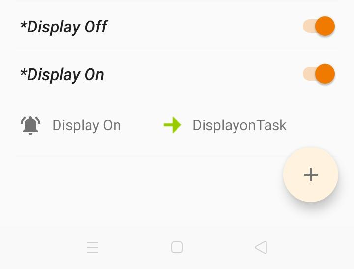
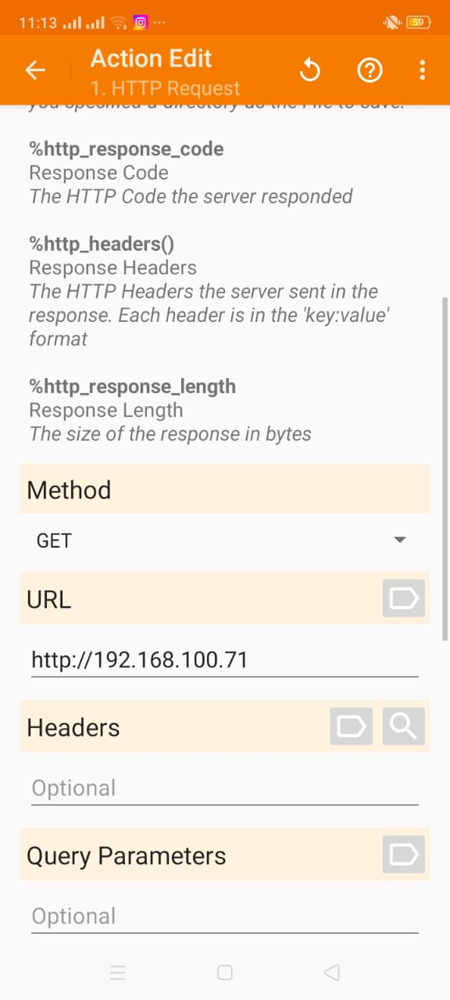
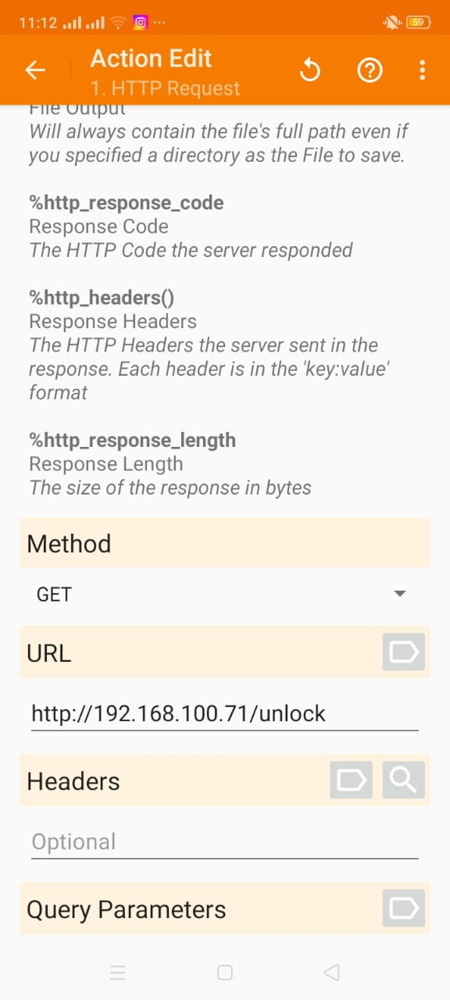

# LAN Screen Control

A smart automation solution that detects your Android device's display state and remotely controls your Windows PC screen lock status via WiFi. When your phone's display turns off, your Windows screen automatically locks, and when you unlock your phone, your Windows screen unlocks.

## Features

- 🔒 **Automatic Screen Locking** - Locks Windows when phone display is turned off
- 🔓 **Automatic Screen Unlocking** - Unlocks Windows when phone display is turned on
- 📱 **WiFi Integration** - Seamless LAN communication via WiFi
- 🤖 **Tasker Automation** - Easy integration with Android Tasker app
- ⚡ **Real-time Response** - Instant lock/unlock actions
- 🖥️ **Windows Compatible** - Supports Windows operating systems

## Requirements

### System Requirements
- Windows OS (Windows 7 or later)
- Python 3.6+
- Android device (for Tasker automation)
- Same WiFi network for both Android device and Windows PC

### Dependencies

**Windows:**
- Flask - Web framework for the server
- interception - Keyboard/mouse input driver for Windows
- ctypes - Windows API interaction (built-in with Python)

**Android:**
- Tasker app - Download from: https://oceanofapks.com/tasker-v6-1-32-patched-apk-free-download/

### Driver Installation
The project requires the **Interception** driver to handle keyboard input:

1. Download `install-interception.exe` from: https://github.com/oblitum/Interception/releases/tag/v1.0.1
2. Run the installer as Administrator
3. Restart your Windows PC to complete driver installation

## Installation

### Step 1: Install Python Dependencies
```bash
pip install flask
```

### Step 2: Install Interception Driver
1. Download the driver from the link above
2. Run `install-interception.exe` as Administrator
3. Restart your computer

### Step 3: Clone/Download the Project
```bash
git clone <your-repo-url>
cd LANSCREENCONTROL
```

## Setup Instructions

### Server Setup (Windows PC)

1. **Configure Your Network IP**
   - Run the application from your Windows PC
   - Note your PC's local network IP address (e.g., 192.168.1.x)
   - The server runs on port 80

2. **Start the Server**
   ```bash
   python main.py
   ```
   - The Flask server will start and listen on `http://0.0.0.0:80`

### Tasker Setup (Android Phone)

#### Step-by-Step Guide to Create Display Lock/Unlock Automation

**Prerequisites:**
- Tasker app installed on Android device
- Same WiFi network as your Windows PC
- Your PC's local IP address (from `ipconfig` command)

#### Part 1: Create "Display OFF" Profile (Auto-Lock)

1. **Open Tasker** and go to the **Profiles** tab
2. **Create a new Profile**
   - Tap the **+** button to add a new profile
   - Search for and select **"Display"** context
3. **Set Display State to OFF**
   - Select **"State"** option
   - Choose **"OFF"** from the dropdown
   - This profile will trigger whenever the display turns off
4. **Create a Task for this Profile**
   - When prompted, create a **new Task** (or name it something like "LockPC")
   - Tap the **+** button to add an action
5. **Add HTTP Request Action**
   - Select **"Net"** → **"HTTP GET"**
   - Configure as follows:
     - **Server:Port** - `http://YOUR_PC_IP/` (replace with your actual PC IP, e.g., `http://192.168.1.100/`)
     - **Timeout (Seconds)** - `10`
     - **Trust Any Certificate** - Enable (for local network)



6. **Save the Profile**
   - Tap back/save to confirm the profile is active

#### Part 2: Create "Display ON" Profile (Auto-Unlock)

1. **Create another new Profile**
   - Tap the **+** button again in Profiles tab
   - Search for and select **"Display"** context
2. **Set Display State to ON**
   - Select **"State"** option
   - Choose **"ON"** from the dropdown
   - This profile will trigger when the display turns on
3. **Create a Task for this Profile**
   - Create a **new Task** (or name it "UnlockPC")
   - Tap the **+** button to add an action
4. **Add HTTP Request Action**
   - Select **"Net"** → **"HTTP GET"**
   - Configure as follows:
     - **Server:Port** - `http://YOUR_PC_IP/unlock` (replace with your actual PC IP, e.g., `http://192.168.1.100/unlock`)
     - **Timeout (Seconds)** - `10`
     - **Trust Any Certificate** - Enable (for local network)



5. **Save the Profile**
   - Tap back/save to confirm the profile is active

#### Part 3: Verify HTTP Configuration



The above screenshot shows the complete HTTP GET action configuration:
- **Server:Port** contains the full URL
- **Timeout** is set appropriately
- All other settings are at their defaults

#### Testing Your Setup

1. **Test the Lock Function**
   - Navigate to Tasker's profile page
   - Open the Display OFF profile task
   - Use the play button (►) to manually run the task
   - Your Windows screen should lock immediately

2. **Test the Unlock Function**
   - Open the Display ON profile task
   - Use the play button to manually run the task
   - Your Windows screen should unlock with the configured password

3. **Automate the Trigger**
   - Disable your phone's display (lock the device)
   - Your Windows PC should lock automatically
   - Unlock your phone
   - Your Windows PC should unlock automatically

#### Troubleshooting Tasker Configuration

- **HTTP requests failing?** - Ensure both devices are on the same WiFi network
- **Profile not triggering?** - Enable Tasker's accessibility service (Settings → Security → Accessibility)
- **Tasks not running?** - Verify Tasker has the necessary permissions
- **Network timeouts?** - Check your PC's IP address and ensure it's accessible from your phone (test by opening the URL in phone's browser)

## API Endpoints

### Lock Screen
- **Endpoint:** `GET /`
- **Method:** GET or POST
- **Description:** Locks the Windows screen immediately
- **Example:** `http://192.168.1.100/`

### Unlock Screen
- **Endpoint:** `GET /unlock`
- **Method:** GET or POST
- **Description:** Sends Enter key and types your password to unlock Windows
- **Note:** The password is currently hardcoded as "KILUNGULE" (modify in the code for security)
- **Example:** `http://192.168.1.100/unlock`

## Usage

Once set up:

1. When your Android phone's display turns **OFF**:
   - Tasker automatically sends a request to `/`
   - Your Windows PC screen locks immediately

2. When your Android phone's display turns **ON**:
   - Tasker automatically sends a request to `/unlock`
   - Your Windows PC screen unlocks with the stored password

## Configuration

### Changing the Unlock Password
Edit `main.py` line 25:
```python
text="KILUNGULE"  # Replace with your actual Windows password
```

### Changing the Server Port
Edit `main.py` line 32:
```python
app.run(debug=True,host="0.0.0.0",port=80)  # Change port number if needed
```

## Security Considerations

⚠️ **Important Security Notes:**

1. **Password Hardcoding** - The unlock password is currently hardcoded in the script. For production use:
   - Use environment variables to store the password
   - Implement authentication/authorization
   - Use HTTPS instead of HTTP
   - Consider adding API key validation

2. **Network Security:**
   - Ensure your WiFi network is password-protected
   - Consider using a local network only (do not expose to the internet)
   - Implement firewall rules to restrict access to port 80

3. **Port 80 Usage:**
   - Currently runs on port 80 (standard HTTP)
   - Consider using higher ports (8000+) if port 80 conflicts with other services
   - Run as Administrator when using port 80

## Troubleshooting

### Server won't start
- Ensure you're running as Administrator
- Check if port 80 is already in use: `netstat -ano | findstr :80`
- Verify Flask is installed: `pip install flask`

### Interception driver issues
- Reinstall the driver and restart Windows
- Ensure you ran the installer as Administrator

### Tasker not connecting
- Verify both devices are on the same WiFi network
- Check your PC's local IP address: `ipconfig` (look for IPv4 address)
- Test URL manually in your browser: `http://<PC_IP>/`

### Screen not locking/unlocking
- Verify Tasker has received the HTTP requests (check Tasker logs)
- Test the endpoints manually from the PC browser
- Ensure the password is correctly configured

## License

MIT License - Feel free to use, modify, and distribute this project.

## Author

Created as a personal automation project for smart device integration.

## Contributing

Contributions are welcome! Please feel free to submit pull requests or issues.

---

**Note:** This project is in active development. Use at your own risk and always test thoroughly before relying on it for important tasks.
